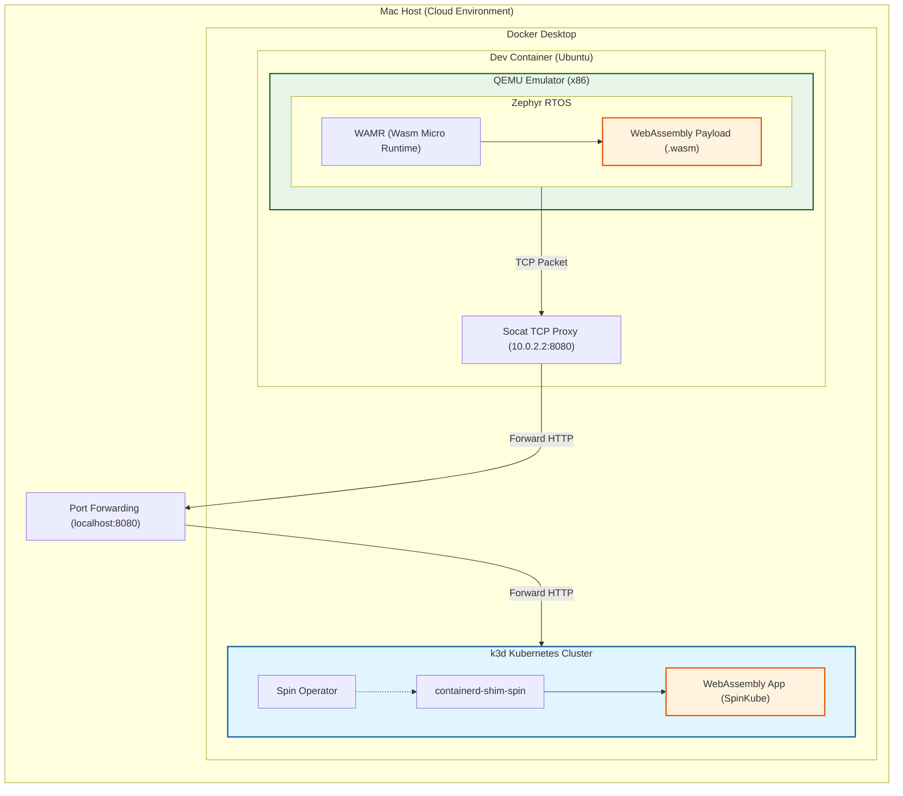
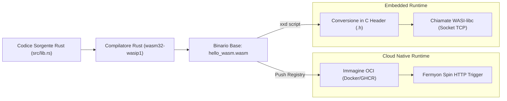
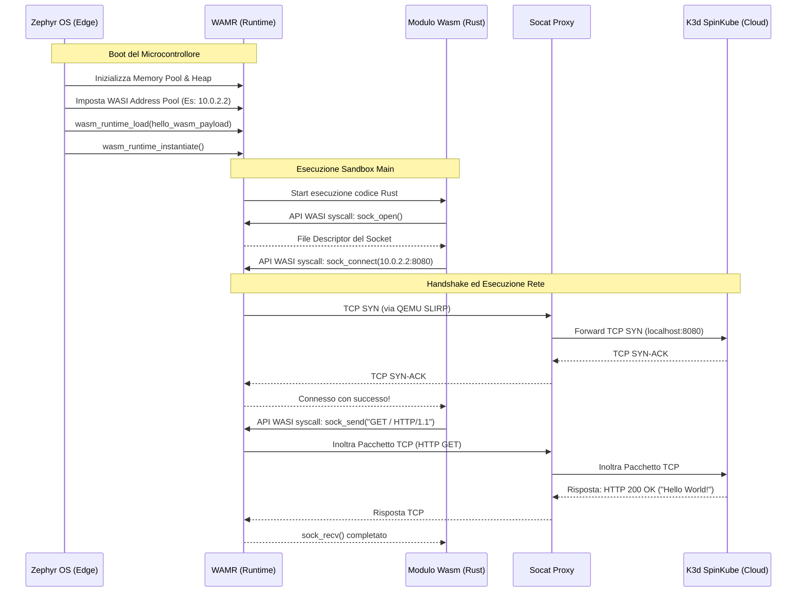

# Architettura del Sistema: Diagrammi UML

Questo documento contiene i diagrammi architetturali e UML generati per descrivere la tua tesi. 
Essendo scritti in **Mermaid** (un linguaggio supportato nativamente da GitHub e da VS Code/Cursor), puoi visualizzarli direttamente aprendo l'anteprima Markdown del tuo editor (tasto destro sulla tab del file -> "Open Preview" oppure icona della lente in alto a destra).

---

## 1. Diagramma di Deployment (Impiego e Ambienti)

Questo diagramma mostra *dove* vivono i vari componenti fisici ed emulati, mettendo in risalto la separazione netta tra l'ambiente Cloud (Host Mac) e l'ambiente Edge (Dev Container).

---

## 2. Diagramma dei Componenti (Logica Applicativa)

Questo diagramma si concentra sull'aspetto del "Write Once, Run Anywhere". Mostra come lo stesso codice sorgente Rust venga compilato in un unico modulo e distribuito in due runtime differenti.

---

## 3. Diagramma di Sequenza (Comunicazione di Rete)

Questo diagramma UML temporale (Sequence Diagram) mostra esattamente i passaggi logici e temporali della comunicazione TCP End-to-End, dall'avvio della board fino alla risposta HTTP.

